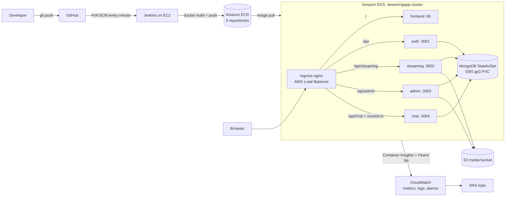

# StreamingApp: Orchestration and Scaling

A MERN streaming platform (auth, streaming, admin, chat services + React frontend + MongoDB) containerized with Docker, built by Jenkins, stored in Amazon ECR, deployed to Amazon EKS with Helm, and monitored with CloudWatch.

- Fork of: https://github.com/UnpredictablePrashant/StreamingApp
- Region: `ap-south-1` (Mumbai) for ECR, EKS, S3 and CloudWatch
- AWS account: `280768229384`

---

## 1. Architecture



### Components

| Component | Port | Notes |
|---|---|---|
| frontend | 80 | React build served by Nginx, SPA fallback via `try_files` |
| auth | 3001 | Register, login, JWT. Routes under `/api`, health at `/health` |
| streaming | 3002 | Catalogue and playback. Routes under `/api/streaming`, health at `/api/health` |
| admin | 3003 | Uploads (signed S3 URLs). Routes under `/api/admin` |
| chat | 3004 | REST under `/api/chat` plus Socket.IO |
| mongo | 27017 | StatefulSet with a 5Gi gp3 EBS volume |

Pipeline and infrastructure summary:

| Piece | Choice |
|---|---|
| CI | Jenkins on an EC2 `t3.medium` (Ubuntu 22.04), IAM role `jenkins-ec2-role` (no static keys on the box) |
| Registry | ECR: `streamingapp-auth`, `-streaming`, `-admin`, `-chat`, `-frontend` |
| Cluster | EKS 1.34, managed node group of 2 x `t3.medium`, created with `eksctl` |
| Packaging | Helm chart in `streamingapp/` |
| Ingress | ingress-nginx, one Load Balancer, path-based routing |
| Monitoring and logs | CloudWatch Container Insights (`amazon-cloudwatch-observability` addon), Fluent Bit to CloudWatch Logs |

---

## 2. Repository layout

```
.
├── Jenkinsfile              # CI pipeline: build and push 5 images to ECR
├── k8s/
│   ├── cluster.yaml         # eksctl cluster config
│   └── storageclass.yaml    # gp3 default StorageClass
├── streamingapp/            # Helm chart
│   ├── Chart.yaml
│   ├── values.yaml
│   └── templates/
│       ├── _helpers.tpl
│       ├── configmap.yaml
│       ├── secret.yaml
│       ├── backend-deployments.yaml   # one loop, 4 backend services
│       ├── backend-services.yaml
│       ├── frontend.yaml
│       ├── mongo.yaml                 # StatefulSet + PVC
│       └── ingress.yaml
├── backend/                 # authService, streamingService, adminService, chatService
├── frontend/                # React app, Dockerfile, nginx.conf
├── docker-compose.yml       # local development
└── docs/                    # screenshots
```

---

## 3. Step-by-step deployment

### Step 1: Git

```bash
git clone https://github.com/atul-chakrawarti/StreamingApp.git
cd StreamingApp
git remote add upstream https://github.com/UnpredictablePrashant/StreamingApp.git
git fetch upstream
```

My fork's `main` had an unrelated history, so I reset it to the upstream code with `git reset --hard upstream/main` and force-pushed (it only contained a README).

### Step 2: Run locally with Docker

```bash
cp .env.example .env        # set JWT_SECRET, leave AWS values empty locally
docker compose up -d --build
```

All six containers (mongo, auth, streaming, admin, chat, frontend) came up and the app opened on `http://localhost:3000`. The repo already ships a Dockerfile for every service, so I reviewed and reused them. Streaming, admin and chat use `backend/` as the build context.

### Step 3: AWS CLI and ECR

```bash
aws configure                      # IAM user, region ap-south-1
export AWS_REGION=ap-south-1
export ACCOUNT_ID=280768229384
for r in streamingapp-auth streamingapp-streaming streamingapp-admin streamingapp-chat streamingapp-frontend; do
  aws ecr create-repository --repository-name $r --region $AWS_REGION \
    --image-scanning-configuration scanOnPush=true
done
aws ecr get-login-password --region $AWS_REGION | \
  docker login --username AWS --password-stdin $ACCOUNT_ID.dkr.ecr.$AWS_REGION.amazonaws.com
```

### Step 4: Jenkins on EC2

1. Launched an EC2 `t3.medium` (Ubuntu 22.04, 20 GB) in a public subnet. Security group allows ports 22 and 8080 only from my IP.
2. Installed Jenkins, Docker, AWS CLI, kubectl, Helm and eksctl. Added `jenkins` to the `docker` group.
3. Attached IAM role `jenkins-ec2-role` to the instance so the pipeline gets AWS access without stored keys.
4. Plugins: Docker Pipeline, Amazon ECR, GitHub Integration (plus the suggested set).
5. Created Pipeline job `streamingapp-ci` ("Pipeline script from SCM", branch `*/main`, script path `Jenkinsfile`).
6. Trigger: **Poll SCM** with schedule `* * * * *`. A webhook would need port 8080 open to GitHub, so polling was the simpler and safer choice. Build #3 showed "Started by an SCM change", which confirmed the auto-trigger.

Pipeline stages: Checkout, ECR Login, Build Images, Push Images, then `docker image prune` in `post`. Images are tagged with the Jenkins build number. `disableConcurrentBuilds()` is set (see problems below).

### Step 5: EKS cluster

```bash
eksctl create cluster -f k8s/cluster.yaml     # about 15-20 minutes
kubectl get nodes
```

`k8s/cluster.yaml` creates EKS 1.34 with a 2 to 3 node managed group, OIDC enabled, and the `aws-ebs-csi-driver` addon (needed for the MongoDB volume). `metrics-server` is installed by eksctl as a default addon, which the HPA uses.

Default StorageClass for MongoDB (`k8s/storageclass.yaml`):

```yaml
apiVersion: storage.k8s.io/v1
kind: StorageClass
metadata:
  name: gp3
  annotations:
    storageclass.kubernetes.io/is-default-class: "true"
provisioner: ebs.csi.aws.com
parameters:
  type: gp3
volumeBindingMode: WaitForFirstConsumer
allowVolumeExpansion: true
```

```bash
kubectl apply -f k8s/storageclass.yaml
```

Ingress controller:

```bash
helm repo add ingress-nginx https://kubernetes.github.io/ingress-nginx
helm repo update
helm install ingress-nginx ingress-nginx/ingress-nginx \
  --namespace ingress-nginx --create-namespace
kubectl get svc -n ingress-nginx ingress-nginx-controller   # note EXTERNAL-IP
```

### Step 6: Deploy with Helm

```bash
LB=<EXTERNAL-IP hostname from above>
helm install streamingapp ./streamingapp \
  --set secrets.jwtSecret="$(openssl rand -hex 24)" \
  --set global.clientUrls="http://$LB" \
  --set frontend.tag=<latest frontend build number> \
  --set secrets.awsS3Bucket=<media bucket name>
kubectl get pods,svc,ingress
```

Notes:

- `global.clientUrls` must be the public URL of the load balancer, otherwise the backends reject browser requests (CORS).
- The JWT secret is passed at install time and never committed.
- Updates are done with `helm upgrade streamingapp ./streamingapp --reuse-values --set <key>=<value>`.
- After changing the ConfigMap or Secret, run `kubectl rollout restart deploy auth streaming admin chat`, because pods do not reload env values by themselves.

### Step 7: S3 media storage (needed for upload and playback)

```bash
aws s3api create-bucket --bucket atul-streamingapp-media-2026 --region ap-south-1 \
  --create-bucket-configuration LocationConstraint=ap-south-1
aws s3api put-public-access-block --bucket atul-streamingapp-media-2026 \
  --public-access-block-configuration BlockPublicAcls=true,IgnorePublicAcls=true,BlockPublicPolicy=true,RestrictPublicBuckets=true
aws s3api put-bucket-cors --bucket atul-streamingapp-media-2026 --cors-configuration file://cors.json
```

The services only use explicit keys if `AWS_ACCESS_KEY_ID` is set. I left it unset and gave the **node IAM role** an inline policy limited to this bucket (`GetObject`, `PutObject`, `DeleteObject`, `ListBucket`). No access keys are stored in the cluster.

To use the admin dashboard, the user's `role` was set to `admin` in MongoDB:

```bash
kubectl exec -it mongo-0 -- mongosh streamingapp --eval \
  'db.users.updateOne({email:"<user email>"},{$set:{role:"admin"}})'
```

The user then logs out and in again to get a fresh token.

### Step 8: Monitoring and logging (CloudWatch)

```bash
aws iam attach-role-policy --role-name <node instance role> \
  --policy-arn arn:aws:iam::aws:policy/CloudWatchAgentServerPolicy
aws eks create-addon --cluster-name streamingapp-cluster \
  --addon-name amazon-cloudwatch-observability --region ap-south-1
kubectl get pods -n amazon-cloudwatch      # cloudwatch-agent and fluent-bit Running
```

- **Metrics:** CloudWatch, Container Insights, cluster `streamingapp-cluster`.
- **Logs:** log group `/aws/containerinsights/streamingapp-cluster/application` (collected by Fluent Bit).
- **Alarm:** `streamingapp-node-cpu-high`, node CPU above 70% for two 5-minute periods, sends to SNS topic `streamingapp-alerts`.

```bash
aws sns create-topic --name streamingapp-alerts --region ap-south-1
aws cloudwatch put-metric-alarm --region ap-south-1 \
  --alarm-name streamingapp-node-cpu-high \
  --namespace ContainerInsights --metric-name node_cpu_utilization \
  --dimensions Name=ClusterName,Value=streamingapp-cluster \
  --statistic Average --period 300 --evaluation-periods 2 \
  --threshold 70 --comparison-operator GreaterThanThreshold \
  --alarm-actions <SNS topic ARN>
```

---

## 4. Helm chart design

- `values.yaml` holds the registry, image names and tags, replicas, ports, probe type, Mongo storage size, secrets and ingress settings. Nothing is hardcoded in `templates/`.
- Backend Deployments and Services are generated by one `range` loop over `.Values.services`.
- Every Deployment uses `RollingUpdate` with `maxUnavailable: 0` and `maxSurge: 1`, and has resource requests and limits.
- Probes: auth uses HTTP `/health`, streaming uses HTTP `/api/health`, admin and chat have no health route so they use a TCP probe. Frontend uses HTTP `/`.
- Ingress paths: `/api/streaming`, `/api/admin`, `/api/chat`, `/socket.io` go to their services, `/api` falls back to auth (auth routes are `/api/login`, `/api/register`, etc.), `/` goes to the frontend. Longer prefixes match first.
- The frontend image is built **without** API URLs. `frontend/src/config/env.js` falls back to `window.location.origin`, so one image works behind any Ingress hostname.

---

## 5. Validation

| Check | Result |
|---|---|
| All pods Running and Ready | Yes (`kubectl get pods,svc,ingress -A`) |
| Register and login through the Ingress URL | Works, JWT issued |
| Admin upload (video + thumbnail) to S3 | Works |
| Playback from the browse page | Works |
| Live chat in two browser sessions | Works |
| Self-healing | Deleted both auth pods, new pods created immediately, app stayed reachable |
| Manual scaling | `kubectl scale deploy/streaming --replicas=4`, rolled out successfully |
| Rolling update | `helm upgrade ... --set services.auth.tag=15`, `rollout status` succeeded, no downtime |
| Autoscaling | HPA on `streaming`: CPU target 60%, min 2, max 5 (`kubectl get hpa`) |

Screenshots are in `docs/` (pods/services/ingress, login, upload, chat in two windows, Jenkins builds, ECR, CloudWatch dashboard, log group, alarm).

---

## 6. Problems I faced and how I fixed them

| Problem | Cause | Fix |
|---|---|---|
| `refusing to merge unrelated histories` | My fork's `main` did not share history with upstream | Reset `main` to `upstream/main` and force-pushed |
| SSH and Jenkins timing out after an EC2 restart | Public IP changed, and my home IP changed so the security group no longer matched | Updated the security group source to My IP, used the new public IP |
| Frontend image never reached ECR | Push loop in the Jenkinsfile did not include `frontend` | Added `frontend` to the loop |
| Build failed at `COPY . .` (containerd "no such file" error) | Two builds overlapped and one cleaned up the other's layers | `disableConcurrentBuilds()` plus `docker system prune` |
| MongoDB pod and PVC stuck in Pending, backends crash looping | No default StorageClass on the new cluster | Created a `gp3` default StorageClass (EBS CSI) and recreated the PVC |
| Page loaded then broke / `/profile` returned 404 | Nginx had no SPA fallback for React Router routes | Added `nginx.conf` with `try_files $uri /index.html` |
| Browser requests blocked | `CLIENT_URLS` was still `http://localhost:3000` | Set `global.clientUrls` to the load balancer URL and restarted the backends |
| "Admin privileges required" | User role was `user`, and the old JWT still carried it | Set role to `admin` in MongoDB, logged in again |
| `kubectl autoscale --cpu-percent` printed a deprecation error | Flag deprecated in newer kubectl | HPA was still created; use `--cpu` or a Helm HPA template |

---

## 7. Production recommendations

For a production cluster I would use separate namespaces per environment, with ResourceQuotas and NetworkPolicies, and terminate TLS at the Ingress with cert-manager and a real domain instead of plain HTTP on a load balancer hostname. I would put HPAs in the Helm chart for every service, add PodDisruptionBudgets and run MongoDB as a managed service (DocumentDB or Atlas) rather than a single-replica StatefulSet. Secrets would come from AWS Secrets Manager (External Secrets) rather than Helm values, and IAM would move from the shared node role to IRSA or Pod Identity with least-privilege policies per service. The Jenkins server would sit behind HTTPS and a GitHub webhook, and images would be tagged with the Git commit SHA and deployed to the cluster automatically by the pipeline.

---

## 8. Bonus: ChatOps (SNS)

- SNS topic `streamingapp-alerts` is created and attached to the CloudWatch CPU alarm.
- Planned next: publish pipeline success/failure from the Jenkinsfile `post` block with `aws sns publish`, and forward the topic to Slack or Telegram (AWS Chatbot or a small Lambda).

---

## 9. Cleanup (to stop AWS charges)

```bash
helm uninstall streamingapp
helm uninstall ingress-nginx -n ingress-nginx     # removes the AWS load balancer
eksctl delete cluster -f k8s/cluster.yaml
```

Then check EC2 > Load Balancers and EC2 > Volumes for leftovers, and stop the Jenkins EC2 instance.